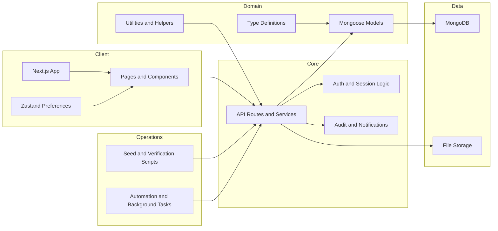

    

    <b>Automatic Architecture Diagrams from Code</b> 
    <a href="https://github.com/JashanMaan28/swark-continued">GitHub (Fork)</a> • <a href="https://github.com/swark-io/swark">Original Project</a>

## Usage Instructions

1. **Render the Diagram**: Use the links below to open it in Mermaid Live Editor, or install the [Mermaid Support](https://marketplace.visualstudio.com/items?itemName=bierner.markdown-mermaid) extension.
2. **Recommended Model**: If available for you, use `gemini` [language model](vscode://settings/swark-continued.languageModel). It can process more files and generates better diagrams.
3. **Iterate for Best Results**: Language models are non-deterministic. Generate the diagram multiple times and choose the best result.

## Generated Content
**Model**: MAI-Code-1-Flash - [Change Model](vscode://settings/swark-continued.languageModel)  
**Mermaid Live Editor**: [View](https://mermaid.live/view#pako:eNp9U8FOwzAM_ZUoZ-ADekBiVAjQBtMKHKAcQuu2YW1SJS4wTft37KztCmhc5tl-9ouf3a3MbA4ykqkpavuZVcqhmK9SI4Tv3kqn2kpc1hoMckiIi7Z9SeUdfOHZu2cvla_7zOMNJZaqBC-UycWlbVprqM6PiKWDgjDPnUdGsAsOTAYDBEyemp_U1kFPvOT-9CtWtsOeJAH3oQ_1hOqwYhiZHuC9tkbMbamzCSrXGGBkA-7Ooi50ppDAx18T20Zps--xINlqT00W1pTWeugjI8nDpgXOsxUxFNroaXcSDHVowJZS_UjXULfg_nmDQrWvj2cDezwbm17pOrCyFQlaRws52uuemPqRQ3GSOd0ilycAeXjOE7hRmCE_kt3aN79Xm4QJCC6ZqWxdOtvR3wfl139GoaMRp6fndDDsPd4EhxbLHt_EJMnrDlna50-fFjcN9NqbYS8hSLJMIEGZwMi6T0nDpn616Uedwnjagy9PZAOO7iGnj2ebSqygIaUjkcocCtXVmModgbo2VwixViR5IyN0HZxIRYolG5MNPqlVVjIqVO1h9w2CtCrD) | [Edit](https://mermaid.live/edit#pako:eNp9U8FOwzAM_ZUoZ-ADekBiVAjQBtMKHKAcQuu2YW1SJS4wTft37KztCmhc5tl-9ouf3a3MbA4ykqkpavuZVcqhmK9SI4Tv3kqn2kpc1hoMckiIi7Z9SeUdfOHZu2cvla_7zOMNJZaqBC-UycWlbVprqM6PiKWDgjDPnUdGsAsOTAYDBEyemp_U1kFPvOT-9CtWtsOeJAH3oQ_1hOqwYhiZHuC9tkbMbamzCSrXGGBkA-7Ooi50ppDAx18T20Zps--xINlqT00W1pTWeugjI8nDpgXOsxUxFNroaXcSDHVowJZS_UjXULfg_nmDQrWvj2cDezwbm17pOrCyFQlaRws52uuemPqRQ3GSOd0ilycAeXjOE7hRmCE_kt3aN79Xm4QJCC6ZqWxdOtvR3wfl139GoaMRp6fndDDsPd4EhxbLHt_EJMnrDlna50-fFjcN9NqbYS8hSLJMIEGZwMi6T0nDpn616Uedwnjagy9PZAOO7iGnj2ebSqygIaUjkcocCtXVmModgbo2VwixViR5IyN0HZxIRYolG5MNPqlVVjIqVO1h9w2CtCrD)

