    

    <b>Automatic Architecture Diagrams from Code</b> 
    <a href="https://github.com/JashanMaan28/swark-continued">GitHub (Fork)</a> • <a href="https://github.com/swark-io/swark">Original Project</a>

## Usage Instructions

1. **Render the Diagram**: Use the links below to open it in Mermaid Live Editor, or install the [Mermaid Support](https://marketplace.visualstudio.com/items?itemName=bierner.markdown-mermaid) extension.
2. **Recommended Model**: If available for you, use `gemini` [language model](vscode://settings/swark-continued.languageModel). It can process more files and generates better diagrams.
3. **Iterate for Best Results**: Language models are non-deterministic. Generate the diagram multiple times and choose the best result.

## Generated Content
**Model**: Claude Haiku 4.5 - [Change Model](vscode://settings/swark-continued.languageModel)  
**Mermaid Live Editor**: [View](https://mermaid.live/view#pako:eNqNV21v2zYQ_iuCBuTLXDRZmzU1igJOXQMB6iWIkw1YvQ-0dHKIyqRGUS6Mov99xzeJFCl4_mLx-NzxeO_8kRe8hHyeb9lekOYle7rdsgx_bbczhG2-EpxJYGX2hZxAbHMDUL_nu6_b_Pku-8QPDWfAZLvN_xm2n17gAIjQ_9mD4EdaKgEe5AsvSA0tgujVDXttlz0ET92ySKElkSS7yDaSSMjWhJE9ymfS12wjudBi_-5aSVB3Q_iwE68__knhO2oDFQhgBYx0PjWaT_1nS6goo5Jydk6lxcMdanTbtZRB2-K19rQILCVprcSqfypP2apjhZarNVpxcSBSgmhninU_MtIGxJEWWi376Vxx1kw70kLstzVne768RXn2Cz3IGGiNgpPXGBxab21ys_o_znFIzwAtCE1VRsBvA9G3_zVbdPIFHUgLEmmAUdOAkCfH69Ye_-fDDsoSyuwZfTXyJjDCpOM1K8MZRiGgmRxKLxKgB3JSUdYrYpaeHqia0BdAJ6rIXMEotu7YkaPznAS7TBy1JlRlHGED2CNlj_BvB60MWFQK1tTnGCjI0HAhzzhuA1JStm8xjoPk8OPQINwJPYdxtzNCRWuYZX9wSauURzdQdIIOHnXrXnyAXtK2qUkPtss09kHQIym8UNHLNPYT1hlWkj4m3TpGp62F1j10zN4PTeZfNzDaGusBFqjej2aZcDqm4BErgJYw-HCgJVj8Qx2LT0uwLBjjWHvAD2WflmD5fPSwejECTVrIxd8FZnhJgwKtCVjr1PHqU9W9lLpqb03LsobvRECPHkjnyhEvOnOvZJ9w23189fBYlQavE9raIyUYngANgIUgku02zqjup_xFdo9lL46uv7j4di_KobYqQqYpCY3uWNuYKj_UIEdJlSETq6rPdu04gA1V5zz2SsyYWXbPamx_Z261oupGlNTZkyDFN2T079PvLgI1B6ZF3KRsJX6EAmgT1WdLTnGk0sexTZavR1WuBKo96gc93UlP2QFnpVevPtphxJDMtybr2SOi6tEhYNfzVEBxc5Om2R3FZk6z44OVbFd6y7Z_szPKNQ1waepLdjODEaAbPRuGBaOz6_bRTtDPo12vX0d7Q5OOhXquiDb9rhttjjttBBj11dAOPSrojIldr-NFu36HS5hraGmxbn4Pm9DMbz-Jy41aToSIUiRCRA0lQgz9Y0LHoAjHB4zqbiJovDo7cURYJxMxEhTGKSt6lXDinFT9mgpXv2BNYc7bP1mPfO2CjEtn2ZBaUzk6QkQS_MOT2epnYTqdR5k4pckoIadgQ9BNIcZxlcLZ7iVPNY7z7hmM8209_wWuquuq8gHq5WPepAZRvYHr6tpH4CtRvwydiJvqGt6PRegnm5VQoYxLH2Adb7cLeAuFv91P5BZwVd2EB4Rjq1WjhHfV7yOUG92cIrADCDS1OeuOgsvqt-oqUNUbX6yUHbyHd4FN-75uEZfV2-LNluWz_AD4JqZlPs9_bHOpO14-x_mhhIp0NXbXnwjqmhLtvaQEp4tDPpeig1lOOsk3J1a4teDd_iWfV6Ru4ed_XICKaw) | [Edit](https://mermaid.live/edit#pako:eNqNV21v2zYQ_iuCBuTLXDRZmzU1igJOXQMB6iWIkw1YvQ-0dHKIyqRGUS6Mov99xzeJFCl4_mLx-NzxeO_8kRe8hHyeb9lekOYle7rdsgx_bbczhG2-EpxJYGX2hZxAbHMDUL_nu6_b_Pku-8QPDWfAZLvN_xm2n17gAIjQ_9mD4EdaKgEe5AsvSA0tgujVDXttlz0ET92ySKElkSS7yDaSSMjWhJE9ymfS12wjudBi_-5aSVB3Q_iwE68__knhO2oDFQhgBYx0PjWaT_1nS6goo5Jydk6lxcMdanTbtZRB2-K19rQILCVprcSqfypP2apjhZarNVpxcSBSgmhninU_MtIGxJEWWi376Vxx1kw70kLstzVne768RXn2Cz3IGGiNgpPXGBxab21ys_o_znFIzwAtCE1VRsBvA9G3_zVbdPIFHUgLEmmAUdOAkCfH69Ye_-fDDsoSyuwZfTXyJjDCpOM1K8MZRiGgmRxKLxKgB3JSUdYrYpaeHqia0BdAJ6rIXMEotu7YkaPznAS7TBy1JlRlHGED2CNlj_BvB60MWFQK1tTnGCjI0HAhzzhuA1JStm8xjoPk8OPQINwJPYdxtzNCRWuYZX9wSauURzdQdIIOHnXrXnyAXtK2qUkPtss09kHQIym8UNHLNPYT1hlWkj4m3TpGp62F1j10zN4PTeZfNzDaGusBFqjej2aZcDqm4BErgJYw-HCgJVj8Qx2LT0uwLBjjWHvAD2WflmD5fPSwejECTVrIxd8FZnhJgwKtCVjr1PHqU9W9lLpqb03LsobvRECPHkjnyhEvOnOvZJ9w23189fBYlQavE9raIyUYngANgIUgku02zqjup_xFdo9lL46uv7j4di_KobYqQqYpCY3uWNuYKj_UIEdJlSETq6rPdu04gA1V5zz2SsyYWXbPamx_Z261oupGlNTZkyDFN2T079PvLgI1B6ZF3KRsJX6EAmgT1WdLTnGk0sexTZavR1WuBKo96gc93UlP2QFnpVevPtphxJDMtybr2SOi6tEhYNfzVEBxc5Om2R3FZk6z44OVbFd6y7Z_szPKNQ1waepLdjODEaAbPRuGBaOz6_bRTtDPo12vX0d7Q5OOhXquiDb9rhttjjttBBj11dAOPSrojIldr-NFu36HS5hraGmxbn4Pm9DMbz-Jy41aToSIUiRCRA0lQgz9Y0LHoAjHB4zqbiJovDo7cURYJxMxEhTGKSt6lXDinFT9mgpXv2BNYc7bP1mPfO2CjEtn2ZBaUzk6QkQS_MOT2epnYTqdR5k4pckoIadgQ9BNIcZxlcLZ7iVPNY7z7hmM8209_wWuquuq8gHq5WPepAZRvYHr6tpH4CtRvwydiJvqGt6PRegnm5VQoYxLH2Adb7cLeAuFv91P5BZwVd2EB4Rjq1WjhHfV7yOUG92cIrADCDS1OeuOgsvqt-oqUNUbX6yUHbyHd4FN-75uEZfV2-LNluWz_AD4JqZlPs9_bHOpO14-x_mhhIp0NXbXnwjqmhLtvaQEp4tDPpeig1lOOsk3J1a4teDd_iWfV6Ru4ed_XICKaw)

```mermaid
graph TB
    subgraph "Frontend Layer"
        UI["UI Components"]
        Theme["Theme Provider"]
        Locales["i18n/Locales"]
    end

    subgraph "Data & State Management"
        Stores["Zustand Stores<br/>View Preferences"]
        Types["Type Definitions"]
    end

    subgraph "API & Business Logic"
        Utils["Utility Functions<br/>Formatters, Logger"]
        Services["Service Layer"]
    end

    subgraph "Database Layer"
        MongoDB["MongoDB Connection"]
        Models["Data Models"]
    end

    subgraph "Data Models"
        UserModel["User Model<br/>+ Authentication"]
        PropertyModel["Property Model<br/>Embedded Units"]
        TenantModel["Tenant Model"]
        LeaseModel["Lease Model"]
        PaymentModel["Payment Model<br/>Proration, Late Fees"]
        InvoiceModel["Invoice Model"]
        MaintenanceModel["Maintenance Request"]
        ComplianceModel["Compliance Report"]
    end

    subgraph "Settings & Preferences"
        SettingsModel["Settings Models<br/>Profile, Notification"]
        SecurityModel["Security Settings"]
        DisplayModel["Display Settings"]
        PrivacyModel["Privacy Settings"]
        CalendarModel["Calendar Settings"]
    end

    subgraph "Communication & Notifications"
        MessageModel["Message Model"]
        ConversationModel["Conversation Model"]
        NotificationModel["Notification Model"]
        AnnouncementModel["Announcement Model"]
        EventModel["Event Model"]
    end

    subgraph "Compliance & Audit"
        AuditLog["Audit Log Model"]
        AuditMiddleware["Audit Middleware"]
    end

    subgraph "Document Management"
        DocumentModel["Document Model"]
        ApplicationModel["Application Model"]
        TemplateModel["Document Template"]
    end

    subgraph "Maintenance & Operations"
        WorkOrderModel["Work Order Model"]
        InspectionModel["Inspection Model"]
        MessageStatusModel["Message Status<br/>Typing, Online"]
    end

    subgraph "Financial Tracking"
        FinancialActionModel["Financial Action"]
        PaymentReceiptModel["Payment Receipt"]
        PaymentNotificationModel["Payment Notification"]
        RecurringPaymentModel["Recurring Payment"]
    end

    UI --> Stores
    Stores --> Types
    Stores --> Utils
    UI --> Theme
    UI --> Locales
    
    Utils --> Services
    Services --> MongoDB
    AuditMiddleware --> AuditLog
    
    MongoDB --> Models
    Models --> UserModel
    Models --> PropertyModel
    Models --> TenantModel
    Models --> LeaseModel
    Models --> PaymentModel
    Models --> InvoiceModel
    Models --> MaintenanceModel
    Models --> ComplianceModel
    
    Models --> SettingsModel
    Models --> SecurityModel
    Models --> DisplayModel
    Models --> PrivacyModel
    Models --> CalendarModel
    
    Models --> MessageModel
    Models --> ConversationModel
    Models --> NotificationModel
    Models --> AnnouncementModel
    Models --> EventModel
    
    Models --> DocumentModel
    Models --> ApplicationModel
    Models --> TemplateModel
    
    Models --> WorkOrderModel
    Models --> InspectionModel
    Models --> MessageStatusModel
    
    Models --> FinancialActionModel
    Models --> PaymentReceiptModel
    Models --> PaymentNotificationModel
    Models --> RecurringPaymentModel
    
    PropertyModel --> TenantModel
    LeaseModel --> PropertyModel
    LeaseModel --> TenantModel
    PaymentModel --> LeaseModel
    InvoiceModel --> LeaseModel
    MaintenanceModel --> PropertyModel
    ComplianceModel --> PropertyModel
    EventModel --> PropertyModel
    ApplicationModel --> PropertyModel

    style Frontend fill:#e1f5ff
    style DataState fill:#f3e5f5
    style APILogic fill:#e8f5e9
    style Database fill:#fff3e0
    style Models fill:#fce4ec
    style Settings fill:#f1f8e9
    style Communication fill:#ede7f6
    style Compliance fill:#ffebee
    style Documents fill:#e0f2f1
    style Maintenance fill:#fbe9e7
    style Financial fill:#f0f4c3
```

