    

    <b>Automatic Architecture Diagrams from Code</b> 
    <a href="https://github.com/JashanMaan28/swark-continued">GitHub (Fork)</a> • <a href="https://github.com/swark-io/swark">Original Project</a>

## Usage Instructions

1. **Render the Diagram**: Use the links below to open it in Mermaid Live Editor, or install the [Mermaid Support](https://marketplace.visualstudio.com/items?itemName=bierner.markdown-mermaid) extension.
2. **Recommended Model**: If available for you, use `gemini` [language model](vscode://settings/swark-continued.languageModel). It can process more files and generates better diagrams.
3. **Iterate for Best Results**: Language models are non-deterministic. Generate the diagram multiple times and choose the best result.

## Generated Content
**Model**: Claude Haiku 4.5 - [Change Model](vscode://settings/swark-continued.languageModel)  
**Mermaid Live Editor**: [View](https://mermaid.live/view#pako:eNqNV81uHEUQfpXRIOUAa2yTGJwVsrT-U1ayk1XW5sJy6J2p2W0x2zOa6dmwSnJEQhwIkEgIBAIhIXgETjxMXgAegeqf6Z-dadt7sLurv6qpv67qeh4nRQrxMJ6xRUXKZXR1PGMR_upmrggXhKWULT6dxf_9-uq3dov_N1DN4s8UWvz0yYQsAMEtTmw_nle7R4-gKqL3onMgvKmgxuWkoglCPCGPyXpOKuRXC8l5USwE56jhqA1ln9cex3lRcBAcaqE4BApZjiulhWEAls7YloFCrrTuzbdyDYzThHBasB4jp3TBxgzhYhGNmbSvg7guW8R12UWIj6DkouGIUlbJ3Y1anpJ6OS9IlUpVX39tCT1aijPzBQ-IJOmhKU0B_Ys-egQkBbG4JJR5UuzKaDGpihIqTqFW-fC7Q4kui7TJfVPFTyAuaC1UccCCIjU5Qc1ErK7IPIfoEwrPeiWcAic0tzI2kaLUUsiTNVRrZEU514xyIW-0Alzhp3rFnaWUu8LEvgMUosx3xcb7ppPJ4xXGWCxOi6TuFaO_J4V0vuXE2_P2FTDCuHL1d3-025Cf1bH2dIs1bp4CqZKluIA05zLeU4761wExxmy19QyfQFUXjOQo42xV5sUGPc1vE6gdoMX1uludPYZn4vpjLNU-ABuVZW3l4S7XlzakwAWkC1knNIva3ykOF0BqnfGvf9G7UBTkqQ6CRpoYjNI1YQmkOgZ12GeS08RA7kL5PiHS_8Hsk8za-0pQr_PlkfW93PaDxmxd0ASMOL3vXjOl2OViJW-a2mGVYXhXxFIaYouT6AdFAnW93RJCURH1iotYSl2wfP_pkkLxERAdHhctSL1YEwQXrYh30vKkwCtCtZJvf_7SIYRUFAitogPu1VCcGw0dsKKpiy8zTGVH02bKqLlrDRrhRd9gQ9Tp_5UlhNQ3AOEx0eEMgwm2VOwprIE1gNo8SZKmRL03uD5Zkop3s9hAXH0sn6F2GM-pCBkluctoiAHGkDOmwDmmpxDx9qcf__37laHc0PwymoPDqCmGs8NySusyJxuHRVMMi3Rf-7YRrXOJF-omA-x7INrZOTIdOQiwrSQIMXUuiPDyIIhqkz0IMH5yZLQGGGv0hWTdF4OByKoXAthObyGWZiBKhoVYPzlu25bjUh2Yr0-vJCzEtyBEF7z1S7rTOXqb4NlQbmvtEC3I17lHiqdxr4i2WwRRTttwVfaySQK7JeEmdLcOhN_aU9FcE93x3_xg9tG9aDQZ-ze2fUFqjPum1CQPLrLIQuVzsA-mAmeB-s3SB5X-s0jVk_uAxnALtqV5m6F_BOFEuuT7f-S6b_A4lgMHJ3PUQpapy4ItitNjX5PJGGFPz6ZXYhmdsbQssLmqurZLSrr77o2KXI-lGt_8hStZQAom-trWWFit7JEcD6uV-sKYlQ0foMk5JPj_Cr7gpALisYupxGNXY8o9PUPVZnQZiMGlHmDVJnmx2JrCONGlW3ulre2SWw48A4nSy63e55jeTtOyruLEqKhydhQk01gVXf21TytVRlUOu4ieKumkssIEaoqH6b3oHqKnlnrn3fu6na2u3uY-SuBkrGVgKklnHAe88P7O0YtrfJC_wLSxDlAFzJ45UeuxzuL8DHGdJaqki_RT0WQz3-AroA0sPgny4Tuwnx1kmXsuQ6wOs_twkB24h9Y2jdjPDuGhi3AGbg3JUMyeC2knRX2ewANIPA3VEKMV3Ms-yPbdY_dZbD7xMHngYpyHqYbsZQ-S-56dphLpD6XwUfahizAvLQ04zA58W01WhCyVN1AdJll6mHpmYiXRghPIhInxIF5BtSI0jYfx81nM1SNrGM3iFDLS5Ph-fomgpkwJB7z-WJtW8ZBXDQxi0vBiumFJu6-KZrGMhxnJa3j5P4dpNwU) | [Edit](https://mermaid.live/edit#pako:eNqNV81uHEUQfpXRIOUAa2yTGJwVsrT-U1ayk1XW5sJy6J2p2W0x2zOa6dmwSnJEQhwIkEgIBAIhIXgETjxMXgAegeqf6Z-dadt7sLurv6qpv67qeh4nRQrxMJ6xRUXKZXR1PGMR_upmrggXhKWULT6dxf_9-uq3dov_N1DN4s8UWvz0yYQsAMEtTmw_nle7R4-gKqL3onMgvKmgxuWkoglCPCGPyXpOKuRXC8l5USwE56jhqA1ln9cex3lRcBAcaqE4BApZjiulhWEAls7YloFCrrTuzbdyDYzThHBasB4jp3TBxgzhYhGNmbSvg7guW8R12UWIj6DkouGIUlbJ3Y1anpJ6OS9IlUpVX39tCT1aijPzBQ-IJOmhKU0B_Ys-egQkBbG4JJR5UuzKaDGpihIqTqFW-fC7Q4kui7TJfVPFTyAuaC1UccCCIjU5Qc1ErK7IPIfoEwrPeiWcAic0tzI2kaLUUsiTNVRrZEU514xyIW-0Alzhp3rFnaWUu8LEvgMUosx3xcb7ppPJ4xXGWCxOi6TuFaO_J4V0vuXE2_P2FTDCuHL1d3-025Cf1bH2dIs1bp4CqZKluIA05zLeU4761wExxmy19QyfQFUXjOQo42xV5sUGPc1vE6gdoMX1uludPYZn4vpjLNU-ABuVZW3l4S7XlzakwAWkC1knNIva3ykOF0BqnfGvf9G7UBTkqQ6CRpoYjNI1YQmkOgZ12GeS08RA7kL5PiHS_8Hsk8za-0pQr_PlkfW93PaDxmxd0ASMOL3vXjOl2OViJW-a2mGVYXhXxFIaYouT6AdFAnW93RJCURH1iotYSl2wfP_pkkLxERAdHhctSL1YEwQXrYh30vKkwCtCtZJvf_7SIYRUFAitogPu1VCcGw0dsKKpiy8zTGVH02bKqLlrDRrhRd9gQ9Tp_5UlhNQ3AOEx0eEMgwm2VOwprIE1gNo8SZKmRL03uD5Zkop3s9hAXH0sn6F2GM-pCBkluctoiAHGkDOmwDmmpxDx9qcf__37laHc0PwymoPDqCmGs8NySusyJxuHRVMMi3Rf-7YRrXOJF-omA-x7INrZOTIdOQiwrSQIMXUuiPDyIIhqkz0IMH5yZLQGGGv0hWTdF4OByKoXAthObyGWZiBKhoVYPzlu25bjUh2Yr0-vJCzEtyBEF7z1S7rTOXqb4NlQbmvtEC3I17lHiqdxr4i2WwRRTttwVfaySQK7JeEmdLcOhN_aU9FcE93x3_xg9tG9aDQZ-ze2fUFqjPum1CQPLrLIQuVzsA-mAmeB-s3SB5X-s0jVk_uAxnALtqV5m6F_BOFEuuT7f-S6b_A4lgMHJ3PUQpapy4ItitNjX5PJGGFPz6ZXYhmdsbQssLmqurZLSrr77o2KXI-lGt_8hStZQAom-trWWFit7JEcD6uV-sKYlQ0foMk5JPj_Cr7gpALisYupxGNXY8o9PUPVZnQZiMGlHmDVJnmx2JrCONGlW3ulre2SWw48A4nSy63e55jeTtOyruLEqKhydhQk01gVXf21TytVRlUOu4ieKumkssIEaoqH6b3oHqKnlnrn3fu6na2u3uY-SuBkrGVgKklnHAe88P7O0YtrfJC_wLSxDlAFzJ45UeuxzuL8DHGdJaqki_RT0WQz3-AroA0sPgny4Tuwnx1kmXsuQ6wOs_twkB24h9Y2jdjPDuGhi3AGbg3JUMyeC2knRX2ewANIPA3VEKMV3Ms-yPbdY_dZbD7xMHngYpyHqYbsZQ-S-56dphLpD6XwUfahizAvLQ04zA58W01WhCyVN1AdJll6mHpmYiXRghPIhInxIF5BtSI0jYfx81nM1SNrGM3iFDLS5Ph-fomgpkwJB7z-WJtW8ZBXDQxi0vBiumFJu6-KZrGMhxnJa3j5P4dpNwU)

```mermaid
graph TB
    subgraph Landing["🏠 Landing Layer"]
        LandingPage["Landing Page<br/>Hero + Features + Pricing"]
        Navbar["Navbar<br/>Logo + Auth Links"]
        Footer["Footer<br/>Links + Branding"]
    end

    subgraph Auth["🔐 Authentication Layer"]
        SignIn["Sign In Page"]
        SignUp["Sign Up Page"]
        AuthLayout["Auth Layout"]
    end

    subgraph Dashboard["📊 Dashboard Layer"]
        DashLayout["Dashboard Layout<br/>Sidebar + Header + Main"]
        
        subgraph Properties["🏢 Properties Module"]
            PropList["Properties List<br/>Cards + Table View"]
            PropDetail["Property Details<br/>Overview + Units + Amenities"]
            PropEdit["Property Edit"]
            UnitDetail["Unit Details<br/>Features + Images + Docs"]
            UnitEdit["Unit Edit"]
        end

        subgraph Tenants["👥 Tenants Module"]
            TenantList["Tenants List<br/>Search + Filter + Status"]
            TenantDetail["Tenant Details<br/>Personal + Employment + Status"]
            TenantEdit["Tenant Edit"]
            TenantNew["New Tenant"]
            TenantApps["Tenant Applications"]
            TenantLedger["Tenant Ledger"]
        end

        subgraph Leases["📝 Leases Module"]
            LeaseList["Leases List<br/>Advanced Filters + Status"]
            LeaseDetail["Lease Details<br/>Overview + Payments + Docs"]
            LeaseEdit["Lease Edit"]
            LeaseNew["New Lease"]
            LeaseInvoice["Lease Invoice"]
            PaymentMgmt["Payment Management<br/>Dashboard + Processing"]
        end

        subgraph Maintenance["🔧 Maintenance Module"]
            MainList["Maintenance List"]
            MainDetail["Maintenance Detail"]
        end

        subgraph Compliance["✅ Compliance Module"]
            CompList["Compliance List"]
            CompDetail["Compliance Detail<br/>Status + Documents + Audit"]
        end

        subgraph Analytics["📈 Analytics Module"]
            AnalyticsMain["Analytics Dashboard<br/>Revenue + Occupancy + Charts"]
            OccupancyAnalytics["Occupancy Analytics"]
            FinancialAnalytics["Financial Analytics"]
        end

        subgraph Settings["⚙️ Settings Module"]
            ProfileSettings["Profile Settings"]
            DisplaySettings["Display Settings<br/>Branding + Theme"]
        end

        DashLayout --> PropList
        DashLayout --> TenantList
        DashLayout --> LeaseList
        DashLayout --> AnalyticsMain
        DashLayout --> CompList
        DashLayout --> Settings

        PropList --> PropDetail
        PropDetail --> PropEdit
        PropDetail --> UnitDetail
        UnitDetail --> UnitEdit

        TenantList --> TenantDetail
        TenantDetail --> TenantEdit
        TenantList --> TenantNew
        TenantList --> TenantApps
        TenantDetail --> TenantLedger

        LeaseList --> LeaseDetail
        LeaseDetail --> LeaseEdit
        LeaseList --> LeaseNew
        LeaseDetail --> LeaseInvoice
        LeaseDetail --> PaymentMgmt

        AnalyticsMain --> OccupancyAnalytics
        AnalyticsMain --> FinancialAnalytics
    end

    subgraph Services["🔗 Services & APIs"]
        PropertyService["Property Service"]
        UnitService["Unit Service"]
        TenantService["Tenant Service"]
        LeaseService["Lease Service"]
        AnalyticsService["Analytics Service"]
    end

    subgraph Data["💾 Data Layer"]
        DB["Database<br/>MongoDB"]
        API["REST API Endpoints<br/>/api/*"]
    end

    subgraph UI["🎨 UI Components"]
        FormComponents["Forms<br/>Input, Select, Textarea"]
        CardComponents["Cards & Layouts<br/>Card, Tabs, Dialog"]
        DataDisplay["Data Display<br/>Table, DataTable, Charts"]
    end

    Landing --> Auth
    Auth --> Dashboard
    
    Dashboard --> Services
    
    PropDetail --> PropertyService
    TenantDetail --> TenantService
    LeaseDetail --> LeaseService
    UnitDetail --> UnitService
    AnalyticsMain --> AnalyticsService
    
    Services --> API
    API --> DB
    
    Dashboard -.->|Uses| UI
    PropList -.->|Uses| DataDisplay
    LeaseDetail -.->|Uses| CardComponents
    TenantEdit -.->|Uses| FormComponents

    style Landing fill:#e1f5ff
    style Auth fill:#f3e5f5
    style Dashboard fill:#f1f8e9
    style Properties fill:#fff3e0
    style Tenants fill:#fce4ec
    style Leases fill:#e0f2f1
    style Maintenance fill:#fff9c4
    style Compliance fill:#f0f4c3
    style Analytics fill:#ede7f6
    style Settings fill:#e8f5e9
    style Services fill:#fff3e0
    style Data fill:#cfd8dc
    style UI fill:#eceff1
```

