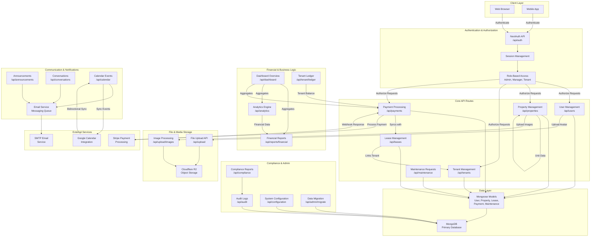

    

    <b>Automatic Architecture Diagrams from Code</b> 
    <a href="https://github.com/JashanMaan28/swark-continued">GitHub (Fork)</a> • <a href="https://github.com/swark-io/swark">Original Project</a>

## Usage Instructions

1. **Render the Diagram**: Use the links below to open it in Mermaid Live Editor, or install the [Mermaid Support](https://marketplace.visualstudio.com/items?itemName=bierner.markdown-mermaid) extension.
2. **Recommended Model**: If available for you, use `gemini` [language model](vscode://settings/swark-continued.languageModel). It can process more files and generates better diagrams.
3. **Iterate for Best Results**: Language models are non-deterministic. Generate the diagram multiple times and choose the best result.

## Generated Content
**Model**: Claude Haiku 4.5 - [Change Model](vscode://settings/swark-continued.languageModel)  
**Mermaid Live Editor**: [View](https://mermaid.live/view#pako:eNqNV1uPozYU_isWD33KKNI-jqqVnITNInErJF2tJlXlgEPcBUwNzGy67H_vsc3NSdrMvIw5d5_b5_ywEp5S69k6lJkg1RntVocSwV_dHjXhYK1zRssGueRCxcHSbPn3xV69HKwv9IhWgr_VkvnHxPWClePaIODxI8spwlU18mmZHsobP7htzuCIJaRhvES_IEnggv2jvuee8X73GSz79HsjZRAOnV-PYvlxSSq2JEAxIontOHYCHxRiWtfStEdKktECnBmC0QqvQSriOX1akZqmCCcJqCjbOC1YuehVxQLtaElm-vevtOaCyuhQxNuG1vM77GM7-hNY4HAPuZvFNF2lBUZthBhGQdhrhYJXVDSXu5qVZjJqqrs2ju1e36VwxbvKueSYijvbx_6u19RXv6vaKNZVzPirZ4_KIblIFQThy9yyMptFrXmmuoedUdkjrFQuEooi-ndL66ae1IuJ-6Aun5iUYiSHLlu1EAREglyesWReosgOg2gXv8zlI1pxMXcqNGF5GkSM4LGP3a87Zy2N4JLkF2jvGtllBi5nLTtwDN0Njj-vAhxtQHdD6vORE5Gi4JWKV0bfJu104F2VerO1o6laLk2hb68rBbWW5IdtXBRtOQ2mzxt26j-Npsa-H-z9ta1uW_IWKqEKOr_qjGwEvA7831-krxJuWGvbk14yJ5t62LX9DZZXXZMcLkAEsl9Nr0nPMBRt6CwXtGzomxzFMq2JLooH7UCgRBn6raUtfZydKmeqJ2FnyTUxT8k68ELXwTopM9GbRkpGntlB-42zk_lsU9bIHp0nU9Kuk_jJ2cpVd6kbWiDI5ollrVB5M7I5kc1pc7YR3ul1uSENQR7LrrWJvOOyUIzHk5bLtHg0ZQTFDRewMow1GLoB3rz0gvsq5yQ193mraOai_iBzmfM2PeUENmz0QYkHx79o0kxeZhqOh7e2HEKnANbd5aP9LJkUqB_cSmXmBhC9wN8GCvHKjG9WynQowKC4IKlxhLV6hZEb240HDS7XMaBxrissUWGBhi2_QGpfL7RRvSclGr1349nfGypgzQx9boxtvIucUPZn3AhWQXq0_f4CQ6qM0LdBsFXwvuU8g8oNo6d0HAgqu9NcsbcLpRf4h9TUKek-onsXgCcGenr62M2eBrRT8K_5-pHxvyLyJAWGZ4Cm9h-KIWF_cCjPozn59phwphsh-x2iA06_Q3SC1vfYnbB0CHmISt1Fd5RmDDHcMMZXwA1niuXW2uT5hjdCtMEZSiS_egbMx0CfR9ftS9htckSuM2eE2rms_Fb3L6_bxF1F2MWXErD2jTXnbrIzuB_BVac6ywTNoHMgxT3qPxIbkf2R4J2SjbpKeHpc6AwYAWgYV3I9kK9ILuf9ruHrFPTDOwx01096PwPqrOTgEX_m_Bs0Wl0BvtL_iFqDu6qlAk9Nl8B9Q-tB-ZqujnocYQkMlieMVCwFecP0wnHePBPIXVNH5LrttfmIdAPGvEKyRdcD0L2e1HIKMKCMGkG0nD7r5fGhd6HMjKTbLKh27B8mXb8-tZQ-K5kVS5kADIPFKVc1aHSjkUNpLayCCtibKfxg-3GwYOEVsDafYb2n9ETaHN4CP0GorVJovQ0jsIML67kRLV1Y8LOIS4PDt-BtdraeTySv6c9_AQ7UVSY) | [Edit](https://mermaid.live/edit#pako:eNqNV1uPozYU_isWD33KKNI-jqqVnITNInErJF2tJlXlgEPcBUwNzGy67H_vsc3NSdrMvIw5d5_b5_ywEp5S69k6lJkg1RntVocSwV_dHjXhYK1zRssGueRCxcHSbPn3xV69HKwv9IhWgr_VkvnHxPWClePaIODxI8spwlU18mmZHsobP7htzuCIJaRhvES_IEnggv2jvuee8X73GSz79HsjZRAOnV-PYvlxSSq2JEAxIontOHYCHxRiWtfStEdKktECnBmC0QqvQSriOX1akZqmCCcJqCjbOC1YuehVxQLtaElm-vevtOaCyuhQxNuG1vM77GM7-hNY4HAPuZvFNF2lBUZthBhGQdhrhYJXVDSXu5qVZjJqqrs2ju1e36VwxbvKueSYijvbx_6u19RXv6vaKNZVzPirZ4_KIblIFQThy9yyMptFrXmmuoedUdkjrFQuEooi-ndL66ae1IuJ-6Aun5iUYiSHLlu1EAREglyesWReosgOg2gXv8zlI1pxMXcqNGF5GkSM4LGP3a87Zy2N4JLkF2jvGtllBi5nLTtwDN0Njj-vAhxtQHdD6vORE5Gi4JWKV0bfJu104F2VerO1o6laLk2hb68rBbWW5IdtXBRtOQ2mzxt26j-Npsa-H-z9ta1uW_IWKqEKOr_qjGwEvA7831-krxJuWGvbk14yJ5t62LX9DZZXXZMcLkAEsl9Nr0nPMBRt6CwXtGzomxzFMq2JLooH7UCgRBn6raUtfZydKmeqJ2FnyTUxT8k68ELXwTopM9GbRkpGntlB-42zk_lsU9bIHp0nU9Kuk_jJ2cpVd6kbWiDI5ollrVB5M7I5kc1pc7YR3ul1uSENQR7LrrWJvOOyUIzHk5bLtHg0ZQTFDRewMow1GLoB3rz0gvsq5yQ193mraOai_iBzmfM2PeUENmz0QYkHx79o0kxeZhqOh7e2HEKnANbd5aP9LJkUqB_cSmXmBhC9wN8GCvHKjG9WynQowKC4IKlxhLV6hZEb240HDS7XMaBxrissUWGBhi2_QGpfL7RRvSclGr1349nfGypgzQx9boxtvIucUPZn3AhWQXq0_f4CQ6qM0LdBsFXwvuU8g8oNo6d0HAgqu9NcsbcLpRf4h9TUKek-onsXgCcGenr62M2eBrRT8K_5-pHxvyLyJAWGZ4Cm9h-KIWF_cCjPozn59phwphsh-x2iA06_Q3SC1vfYnbB0CHmISt1Fd5RmDDHcMMZXwA1niuXW2uT5hjdCtMEZSiS_egbMx0CfR9ftS9htckSuM2eE2rms_Fb3L6_bxF1F2MWXErD2jTXnbrIzuB_BVac6ywTNoHMgxT3qPxIbkf2R4J2SjbpKeHpc6AwYAWgYV3I9kK9ILuf9ruHrFPTDOwx01096PwPqrOTgEX_m_Bs0Wl0BvtL_iFqDu6qlAk9Nl8B9Q-tB-ZqujnocYQkMlieMVCwFecP0wnHePBPIXVNH5LrttfmIdAPGvEKyRdcD0L2e1HIKMKCMGkG0nD7r5fGhd6HMjKTbLKh27B8mXb8-tZQ-K5kVS5kADIPFKVc1aHSjkUNpLayCCtibKfxg-3GwYOEVsDafYb2n9ETaHN4CP0GorVJovQ0jsIML67kRLV1Y8LOIS4PDt-BtdraeTySv6c9_AQ7UVSY)

